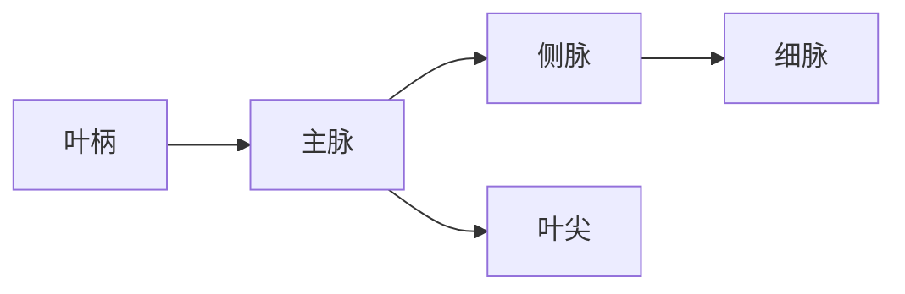

# 叶脉笔记

> [!tip] 观察方法 · 逆光看叶片，脉络会比正面清楚得多。

设主脉流量为 $Q$，第 $n$ 级侧脉的流量近似为

$$
Q_n = Q \cdot r^n, \qquad 0 < r < 1
$$

水分（H~2~O）自根而来，==光合产物==由叶而去；数据记在 `leaf.md`，另见[植物生理学](https://example.com/plant)。

## 从叶柄到叶尖

| 层级 | 作用 | 备注 |
| :--- | :--- | ---: |
| 主脉 | 输送与支撑 | 1 条 |
| 侧脉 | 向两侧分流 | 6–12 对 |
